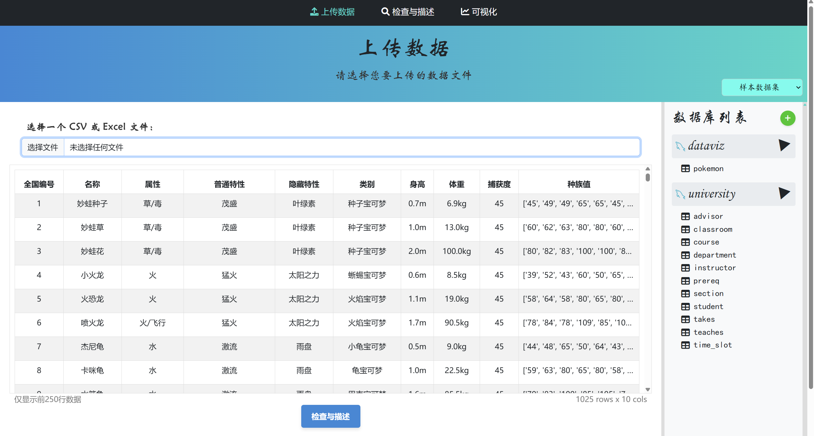
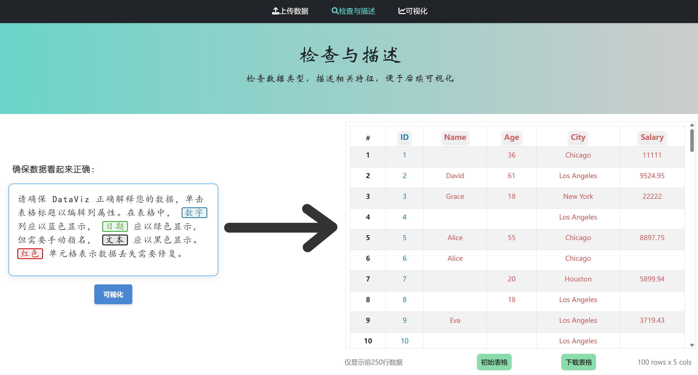
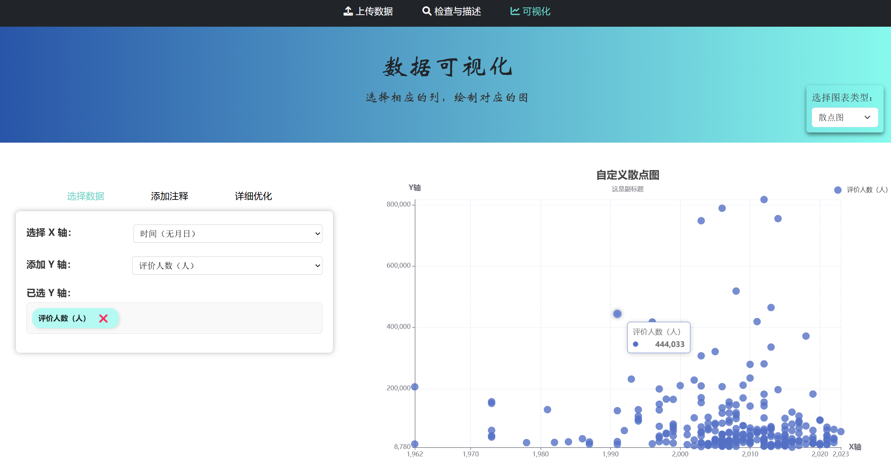

# 🚀 DataViz - 数据可视化平台

## 📌 项目简介
DataViz 是一个基于 Spring Boot 和前端技术的可视化数据平台，旨在提供用户友好的数据处理和可视化功能。用户可以上传 CSV 或 Excel 文件，对数据进行预处理，并通过交互式图表进行可视化分析。

## 🛠 技术栈
- **⚙️ 后端**：Spring Boot、Java、MySQL(未来打算添加)
- **🎨 前端**：HTML、CSS、JavaScript（ECharts）
- **📊 数据处理**：Python（Pandas）

## 🌐 1. 网站入口
打开浏览器，输入网站地址，即可进入 DataViz 首页。首页展示了项目的主要功能和简介，帮助用户快速了解平台(“模型构建” 我打算以后学习机器学习的时候再补上😉)。


## 📂 2. 上传文件
在“上传文件”页面，用户可以选择上传 CSV 或 Excel 文件。
- 📎 点击 **“选择文件”** 按钮，选择要上传的文件，包括 CSV 和 Excel。
- 📊 **使用示例数据**：如果没有数据，也可以使用 **系统自带的样本数据**，这些数据由 **Python 爬虫获取**（[相关代码](https://github.com/Rasrea/python-spider)）。
- ⬆️ 在选择框中双击文件，即可完成文件上传。



## ✏️ 3. 数据预处理（检查与描述）
在数据预处理页面，系统会自动分析你的数据列类型，并提供可视化标识：
- **📘 数字列**：以 **蓝色** 显示。
- **📗 日期列**：以 **绿色** 显示（需手动确认）。
- **🖤 文本列**：以 **黑色** 显示。
- **🔴 丢失数据**：以 **红色** 单元格显示，表示需要修复的数据。

✅ **修改与预处理**：
- 🔍 点击 **列名**，修改数据类型或进行预处理。
- 🛠 在 **“可选列类型”** 中选择系统推测的合适类型。
- 💾 进行必要调整后，点击 **“提交”** 按钮，确保修改生效。

###### 主页面


###### 🔨操作页面


## 📊 4. 可视化数据
📊 可视化数据功能尚在开发中，敬请期待！

作为本项目的重点，我正在积极开发更加丰富的可视化数据功能，未来将支持 多种数据图表，让数据分析更加直观和生动：



## 🎯 5. 未来规划
- 🚀 **完善数据可视化功能**，增加多种图表类型。
- 🎨 **优化用户体验**，提升页面交互效果。
- 🔄 **支持更多数据格式**，如 JSON、SQL 数据库导入。
- 🔗 **增加 API 接口**，支持外部数据接入。

## 💻 6. 本地运行指南
### ⚙️ 环境要求
- ☕ JDK 17 及以上
- 🗄 MySQL 数据库
- 📦 Maven 进行依赖管理
- 🐍 Python（用于数据处理）

### 🚀 启动步骤
1. **📥 克隆项目**
   ```bash
   git clone https://github.com/Rasrea/DataViz.git
   cd DataViz
   ```
2. **⚙️ 配置数据库**
   在 `application.yml` 中修改数据库连接信息。
3. **🔧 运行后端**
   ```bash
   mvn spring-boot:run
   ```
4. **🌍 启动服务器**
   进入com.lucky.data_visual，使用 IDE 或 VS Code 运行 `MyApplication.java`。
5. **🌐 访问网站**
   打开浏览器，访问 `http://localhost:8080`。

## 🤝 7. 贡献指南
欢迎贡献代码！请提交 Pull Request，或者在 Issues 反馈 Bug 和建议。作为一名水大学生，我会尽快回复🤥。

## 📜 8. 许可证
本项目遵循 MIT 许可证，详细信息请查看 LICENSE 文件。

